# ComfyUI – Flux Regenerative Upscale

A ComfyUI workflow for restoring low-resolution, compressed, or noisy animation and stylized art using diffusion-based regeneration. The goal is not simply to enlarge the image — it is to recover and reconstruct degraded detail while preserving the original stylization: linework, cel shading, color palette, and artistic character.

> **Intended media:** Animation and stylized/illustrated content. Behavior on live-action, photographic, or other media has not been tested and results may vary significantly.

https://github.com/komo-248/ComfyUI-Flux-Regenerative-Upscale/assets/videos/comparison.mp4

---

## Table of Contents

- [Purpose & Intent](#purpose--intent)
- [How It Works](#how-it-works)
- [Workflow Diagram](#workflow-diagram)
- [Signal Processing Chain](#signal-processing-chain)
- [Demonstration](#demonstration)
- [Models Used](#models-used)
- [Custom Nodes](#custom-nodes)
- [Workflow Parameters](#workflow-parameters)
- [Installation & Usage](#installation--usage)
- [Credits & Citations](#credits--citations)

---

## Purpose & Intent

This workflow addresses a specific restoration problem: animation and stylized artwork that has been degraded by compression artifacts, low source resolution, or lossy encoding. These sources often have:

- Blocking and ringing from heavy JPEG/video compression
- Washed-out or flattened linework
- Lost high-frequency detail in shading and textures
- Temporal inconsistency across frames

Standard upscalers (Real-ESRGAN, waifu2x) can sharpen and denoise but fundamentally can only work with information already present in the source. They cannot recover detail that has been destroyed by compression — they can only make a best guess at what the original might have looked like.

This workflow uses **FLUX.1-fill-dev** — a diffusion inpainting model — to actually regenerate degraded regions. A signal processing chain analyzes each frame to identify where detail has been lost, constructs a mask targeting those areas, and uses the diffusion model to reconstruct them guided by the frame's remaining structural information (lineart, edges). The result aims to restore the piece to something close to its original quality while preserving the stylistic identity of the source material.

**What this is:**
- Restoration-first: recover lost detail, reduce compression artifacts, rebuild linework
- Stylization-preserving: the output should look like the source material at higher quality, not a different art style
- Diffusion-assisted: damaged regions are regenerated by FLUX, not interpolated

**What this is not:**
- A style transfer tool
- A general-purpose video upscaler
- Tested on live-action or photographic content

---

## How It Works

Each frame goes through three stages:

**1. Signal extraction — building the mask**
Multiple preprocessors analyze the frame to identify where detail is degraded or absent. Lineart extraction, Canny edge detection at two sensitivity levels, and FBCNN artifact simulation are layered and blended into a composite grayscale mask. Bright regions in the mask = high degradation = regenerate. Dark regions = clean = preserve.

**2. Diffusion regeneration**
FLUX.1-fill-dev inpaints the masked regions guided by a ControlNet lineart signal extracted at full resolution. Differential Diffusion applies spatially-varying noise — areas with higher mask values receive more aggressive regeneration. Guidance is kept low (2.0) to let the model restore rather than reimagine.

**3. Post-processing and output**
The regenerated frame passes through a light UltimateSDUpscale pass (denoise 0.01 — nearly zero, just for tile sharpening), a bilateral filter, and brightness/contrast normalization. RIFE 4.7 frame interpolation doubles the frame rate. The final output is scaled to target resolution and encoded as H.264 MP4.

---

## Workflow Diagram

<p align="center">
  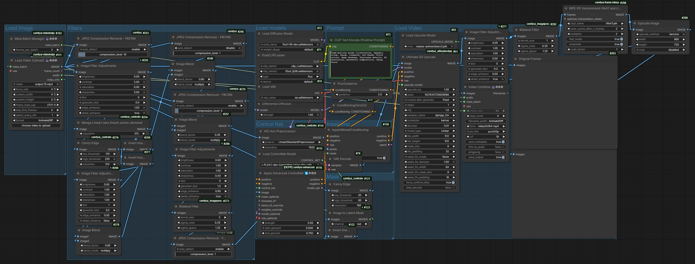
</p>

```
Input Video
     │
     ├────────────────────────────────────────────┐
     │                                            │
     ▼                                            ▼
[Signal Processing Chain]               [Original Frame Preview]
  (see detail below)
     │
     ▼ Composite Mask
[FLUX.1-fill-dev Inpainting]
  ← ControlNet Union Pro (lineart, strength 0.55, end 0.75)
  ← DifferentialDiffusion (spatially-varying noise)
  ← InpaintModelConditioning
  Guidance: 2.0
     │
     ▼
[UltimateSDUpscale — 1.5x, denoise 0.01]
     │
     ▼
[Post-Processing]
  Image Filter Adjustments (brightness +0.05, contrast +1.05)
  → Bilateral Filter (σd=1)
     │
     ▼
[RIFE VFI — rife47, 2x interpolation]
     │
     ▼
[ImageScale — 960×720, Lanczos]
     │
     ▼
[VHS_VideoCombine — H.264 MP4, CRF 19]
```

---

## Signal Processing Chain

The mask construction pipeline is the core of this workflow. A single edge detector produces noisy results — too many false positives in clean areas, too many misses in subtly degraded ones. By stacking multiple detectors at different sensitivities and blending them with multiply operations, the composite mask accumulates confidence: areas flagged by multiple detectors get a strong mask value; areas where detectors disagree stay near zero.

```
Raw frame
  │
  ├─ FBCNN (disabled — pass-through baseline)
  │    → Image Filter: contrast +2, sharpness +5
  │         Purpose: amplify degraded structure so extractors can find it
  │    → Manga2Anime LineArt (512px) → Invert
  │         Purpose: anime-optimized lineart; invert for multiply blending
  │    → Canny soft (30/85, 768px) → Invert
  │         Purpose: wide-net edge detection, catches subtle gradients
  │
  ├─ FBCNN (enabled, strength 10)
  │         Purpose: simulate heavy artifact signal to locate compression-prone regions
  │    → Image Filter → Canny hard (170/255, 512px) → Invert
  │         Purpose: tight structural outlines only — high-confidence edges
  │
  Blend layers:
  → ImageBlend multiply 0.85  (hard edges weighted heavily)
  → ImageBlend multiply 0.60  (artifact regions × edge overlap)
  → FBCNN strength 5 → ImageBlend multiply 0.35  (low-confidence regions at reduced weight)
  │
  → Image Filter (final signal shaping)
  → Bilateral Filter σd=3  (smooth mask without crossing structural boundaries)
  → FBCNN strength 1  (final light cleanup)
  │
  ▼
Composite Mask → InpaintModelConditioning
```

Bright = regenerate. Dark = preserve.

---

## Demonstration
 
> **Copyright disclaimer:** The footage used in this demonstration is from *Hajime no Ippo* and is the property of George Morikawa, Kodansha, and their respective rights holders. It is used here solely for technical evaluation purposes — to demonstrate the restoration capabilities of this workflow on real-world compressed animation sources. No copyright infringement is intended. If you are a rights holder and would like this removed, please open an issue.

https://github.com/user-attachments/assets/4598cdbb-5857-4031-9866-b931ff07540c
 
>**Note:** Frame interpolation and per-frame diffusion regeneration are inherently frame-by-frame processes — frames can be cut, duplicated, or synthesized for consistency and motion blur, which means the output will not align one-to-one with the source. This is an expected limitation of the upscaling process and is why the demonstration video does not match the original frame for frame.


<p align="center"><em>Left: source frame &nbsp;|&nbsp; Right: restored output</em></p>

<p align="center">
  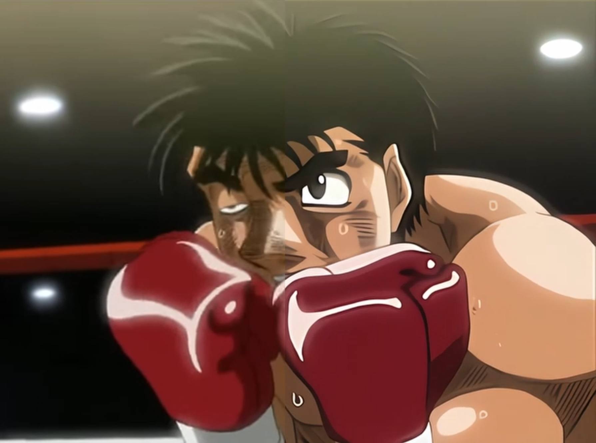
  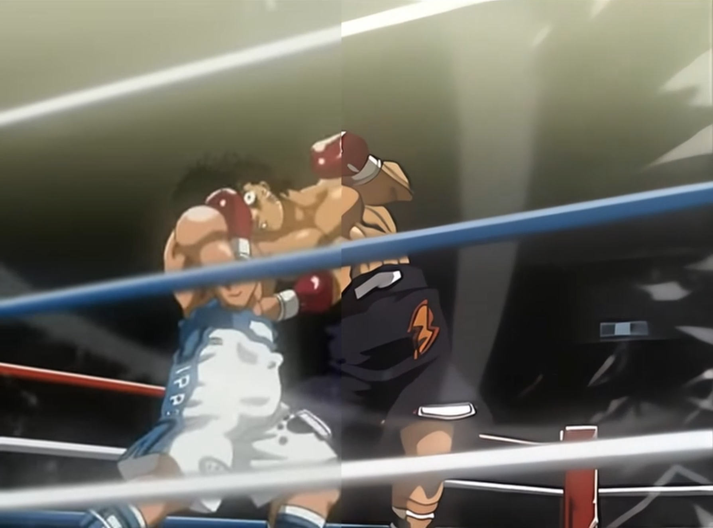
</p>
<p align="center">
  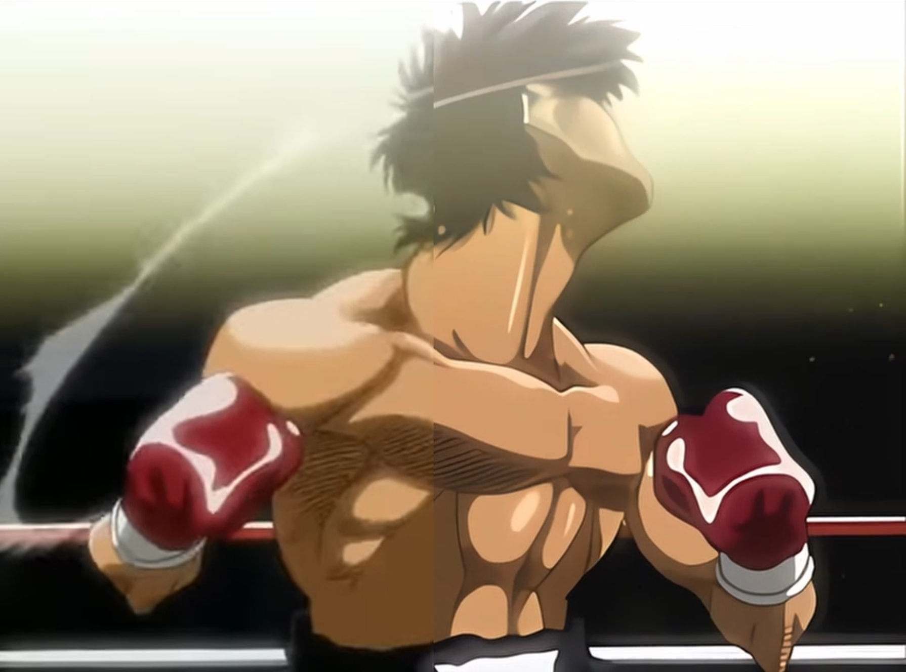
  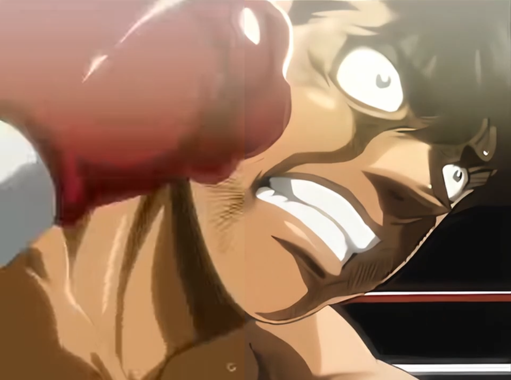
</p>
<p align="center">
  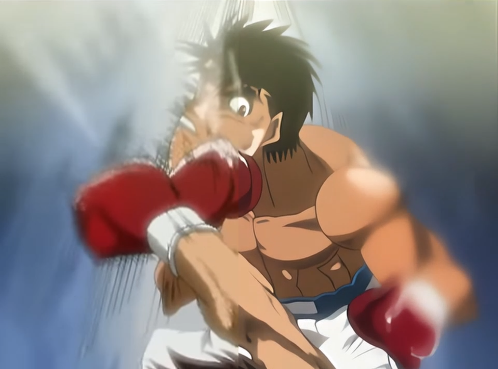
  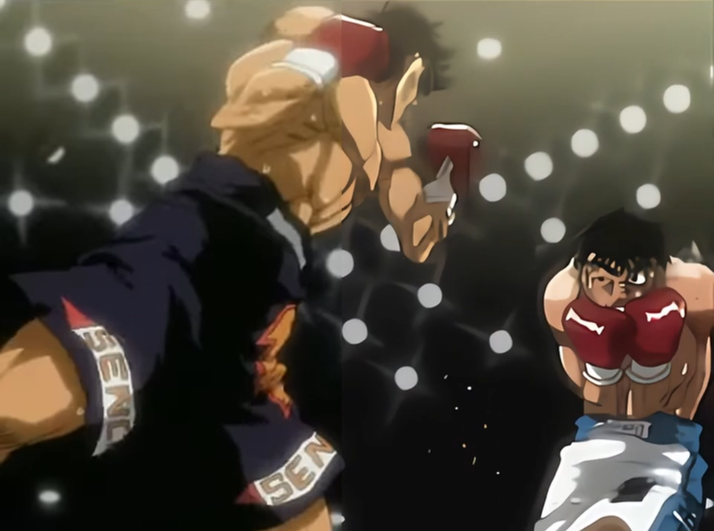
</p>
<p align="center">
  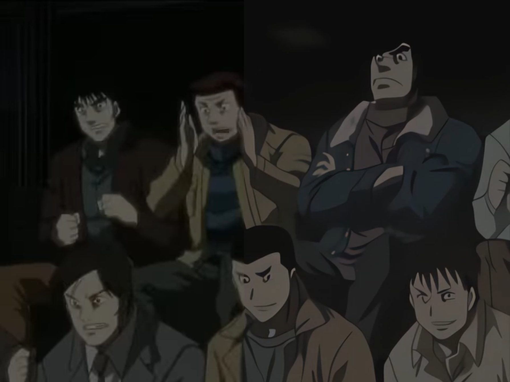
  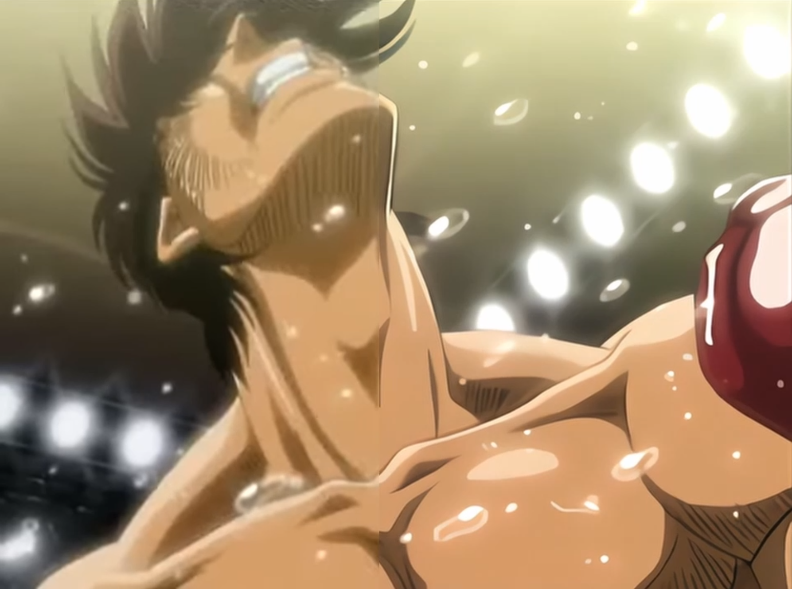
</p>
<p align="center">
  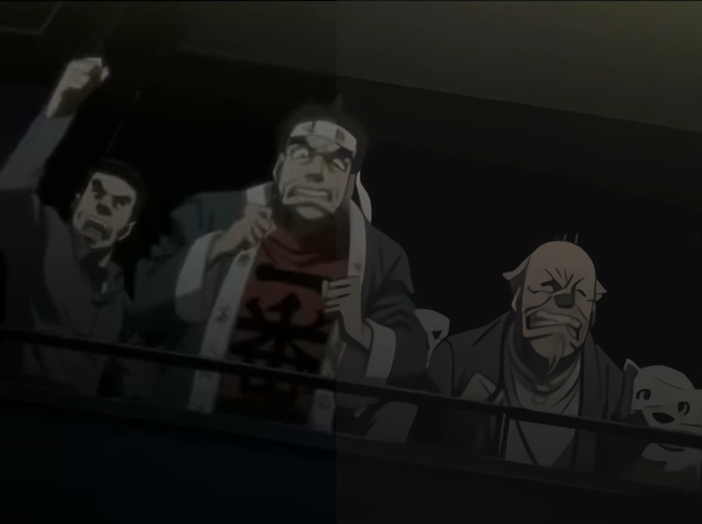
  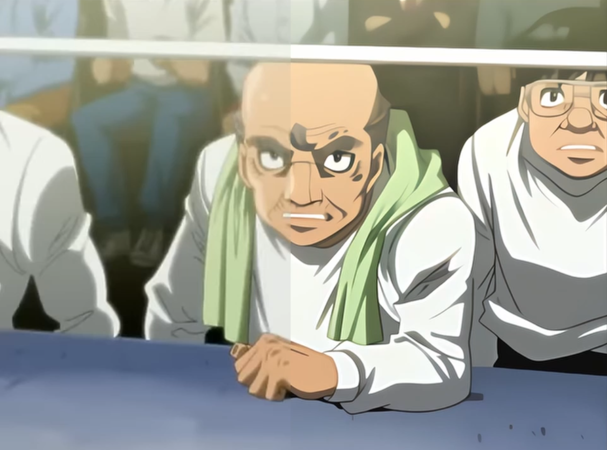
</p>
<p align="center">
  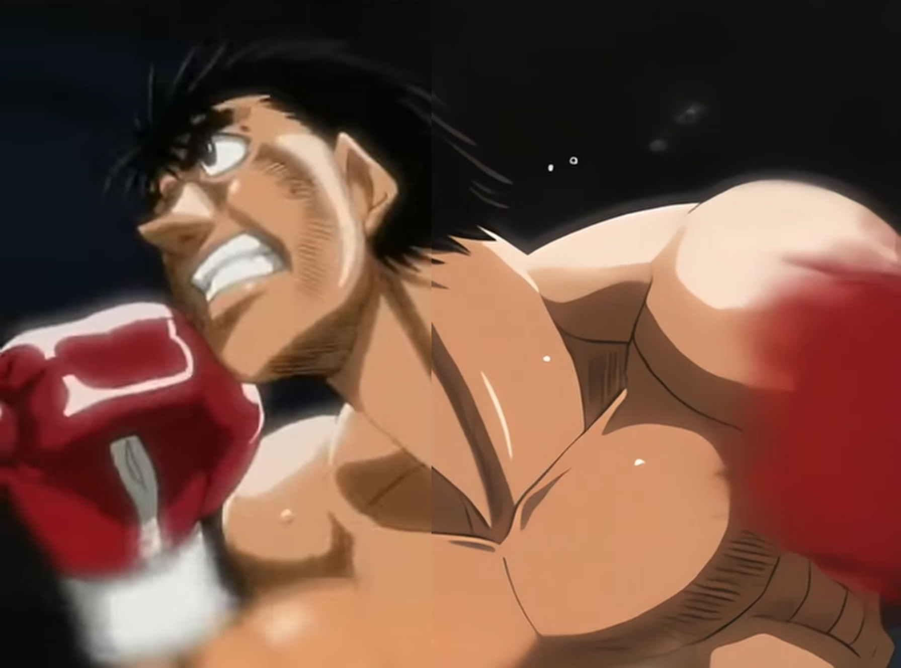
  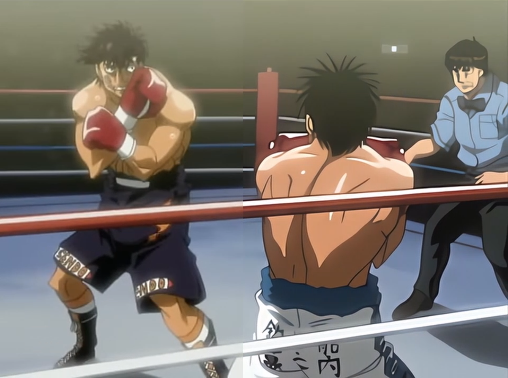
</p>


---

## Models Used

| Model | Location | Source |
|-------|----------|--------|
| `flux1-fill-dev.safetensors` | `models/unet/` | [black-forest-labs/FLUX.1-fill-dev](https://huggingface.co/black-forest-labs/FLUX.1-fill-dev) |
| `clip_l.safetensors` | `models/clip/` | [openai/clip-vit-large-patch14](https://huggingface.co/openai/clip-vit-large-patch14) |
| `t5xxl_fp16.safetensors` | `models/clip/` | [google/t5-v1_1-xxl](https://huggingface.co/google/t5-v1_1-xxl) |
| `ae.safetensors` | `models/vae/` | Included with FLUX.1-fill-dev |
| `FLUX.1-dev-ControlNet-Union-Pro.safetensors` | `models/controlnet/` | [Shakker-Labs/FLUX.1-dev-ControlNet-Union-Pro](https://huggingface.co/Shakker-Labs/FLUX.1-dev-ControlNet-Union-Pro) |
| `realesr-animevideov3.pth` | `models/upscale_models/` | [xinntao/Real-ESRGAN](https://github.com/xinntao/Real-ESRGAN/releases) |
| `rife47.pth` | `models/rife/` | [hzwer/ECCV2022-RIFE](https://github.com/hzwer/ECCV2022-RIFE) |

> FLUX.1-fill-dev requires HuggingFace access agreement. VRAM requirement is ~24GB at full precision. Use fp8 quantization on 16GB or less.

---

## Custom Nodes

Install via [ComfyUI Manager](https://github.com/ltdrdata/ComfyUI-Manager):

| Node Pack | Author | Nodes Used |
|-----------|--------|-----------|
| [ComfyUI-VideoHelperSuite](https://github.com/Kosinkadink/ComfyUI-VideoHelperSuite) | Kosinkadink | `VHS_LoadVideo`, `VHS_VideoCombine`, `VHS_BatchManager`, `VHS_VideoInfo` |
| [ComfyUI-Advanced-ControlNet](https://github.com/Kosinkadink/ComfyUI-Advanced-ControlNet) | Kosinkadink | `ACN_AdvancedControlNetApply` |
| [ComfyUI_UltimateSDUpscale](https://github.com/ssitu/ComfyUI_UltimateSDUpscale) | ssitu | `UltimateSDUpscale` |
| [ComfyUI-Frame-Interpolation](https://github.com/Fannovel16/ComfyUI-Frame-Interpolation) | Fannovel16 | `RIFE VFI` |
| [ComfyUI-Image-Filters](https://github.com/spacepxl/ComfyUI-Image-Filters) | spacepxl | `BilateralFilter`, `Image Filter Adjustments`, `JPEG artifacts removal FBCNN` |
| [comfyui_controlnet_aux](https://github.com/Fannovel16/comfyui_controlnet_aux) | Fannovel16 | `AIO_Preprocessor`, `CannyEdgePreprocessor`, `Manga2Anime_LineArt_Preprocessor` |
| [ComfyUI-FluxTrainer](https://github.com/kijai/ComfyUI-FluxTrainer) | kijai | `FluxGuidance`, `DifferentialDiffusion` |

---

## Workflow Parameters

### Input / Output

| Node | Parameter | Value | Notes |
|------|-----------|-------|-------|
| `VHS_LoadVideo` | Input | — | Source video file |
| `VHS_VideoCombine` | Format | `video/h264-mp4` | H.264 MP4 |
| `VHS_VideoCombine` | CRF | `19` | Quality/size balance |
| `VHS_VideoCombine` | Frame rate | `24` | Match to source |
| `ImageScale` | Resolution | 960×720 | Lanczos — adjust to target |

### FLUX Generation

| Node | Parameter | Value | Notes |
|------|-----------|-------|-------|
| `FluxGuidance` | Guidance | `2.0` | Low — preserves source, reduces hallucination |
| `CLIPTextEncode` | Positive prompt | `High-quality anime illustration, dynamic, crisp, sharp, linework, cel-shade, Vivid colors, deep shadows, Intricate details, 8k resolution, masterful composition, sharp focus` | Tune to match your source style |
| `DifferentialDiffusion` | — | enabled | Spatially-varying noise by mask value |
| `InpaintModelConditioning` | — | enabled | Conditions on masked region |

### ControlNet

| Node | Parameter | Value | Notes |
|------|-----------|-------|-------|
| `AIO_Preprocessor` | Type | `LineartStandardPreprocessor` | Full-res lineart extraction at 1920px |
| `ACN_AdvancedControlNetApply` | Strength | `0.55` | Moderate — guides without over-constraining |
| `ACN_AdvancedControlNetApply` | Start / End | `0.0` / `0.75` | Released at 75% for free final blending |

### Post-Processing

| Node | Parameter | Value | Notes |
|------|-----------|-------|-------|
| `UltimateSDUpscale` | Scale | `1.5x` | Tile-based — tile 512×512, padding 32 |
| `UltimateSDUpscale` | Denoise | `0.01` | Near-zero — structure only, no regeneration |
| `UltimateSDUpscale` | Sampler | `DPM++ 2M Karras` | |
| `RIFE VFI` | Model | `rife47` | Frame interpolation 2x |
| `RIFE VFI` | Ensemble | enabled | Averages forward/backward passes |

---

## Installation & Usage

1. Install [ComfyUI](https://github.com/comfyanonymous/ComfyUI)
2. Install [ComfyUI Manager](https://github.com/ltdrdata/ComfyUI-Manager)
3. Install all custom nodes via Manager (see [Custom Nodes](#custom-nodes))
4. Download all models and place in the correct `models/` subdirectories (see [Models Used](#models-used))
5. Drag `Flux_Regen_Upscale.json` onto the ComfyUI canvas to load the workflow
6. In `VHS_LoadVideo`, select your source video
7. Adjust `VHS_VideoCombine` frame rate and `ImageScale` resolution to match your target
8. Edit the positive prompt in `CLIPTextEncode` to describe your source's art style
9. Set `VHS_BatchManager` batch size based on available VRAM (1–2 on 24GB)
10. Queue the prompt

---

## Credits & Citations

**Models:**
- **FLUX.1-fill-dev** — Black Forest Labs. [black-forest-labs/FLUX.1-fill-dev](https://huggingface.co/black-forest-labs/FLUX.1-fill-dev)
- **FLUX.1-dev ControlNet Union Pro** — Shakker-Labs. [Shakker-Labs/FLUX.1-dev-ControlNet-Union-Pro](https://huggingface.co/Shakker-Labs/FLUX.1-dev-ControlNet-Union-Pro)
- **Real-ESRGAN (animevideov3)** — Xintao Wang et al. [xinntao/Real-ESRGAN](https://github.com/xinntao/Real-ESRGAN). *Real-ESRGAN: Training Real-World Blind Super-Resolution with Pure Synthetic Data*, ICCV 2021.
- **RIFE 4.7** — Zhewei Huang et al. [hzwer/ECCV2022-RIFE](https://github.com/hzwer/ECCV2022-RIFE). *Real-Time Intermediate Flow Estimation for Video Frame Interpolation*, ECCV 2022.
- **FBCNN** — Jiaxi Jiang et al. *Towards Flexible Blind JPEG Artifacts Removal*, ICCV 2021.

**Custom Nodes:**
- ComfyUI — [comfyanonymous/ComfyUI](https://github.com/comfyanonymous/ComfyUI)
- ComfyUI-VideoHelperSuite — [Kosinkadink](https://github.com/Kosinkadink/ComfyUI-VideoHelperSuite)
- ComfyUI-Advanced-ControlNet — [Kosinkadink](https://github.com/Kosinkadink/ComfyUI-Advanced-ControlNet)
- ComfyUI_UltimateSDUpscale — [ssitu](https://github.com/ssitu/ComfyUI_UltimateSDUpscale)
- ComfyUI-Frame-Interpolation — [Fannovel16](https://github.com/Fannovel16/ComfyUI-Frame-Interpolation)
- ComfyUI-Image-Filters — [spacepxl](https://github.com/spacepxl/ComfyUI-Image-Filters)
- comfyui_controlnet_aux — [Fannovel16](https://github.com/Fannovel16/comfyui_controlnet_aux)
- ComfyUI-FluxTrainer — [kijai](https://github.com/kijai/ComfyUI-FluxTrainer)
- ComfyUI Manager — [ltdrdata](https://github.com/ltdrdata/ComfyUI-Manager)
